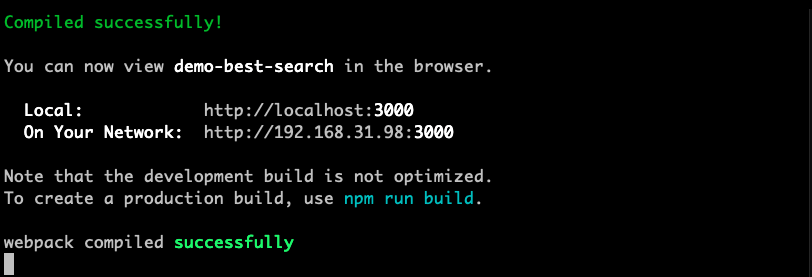
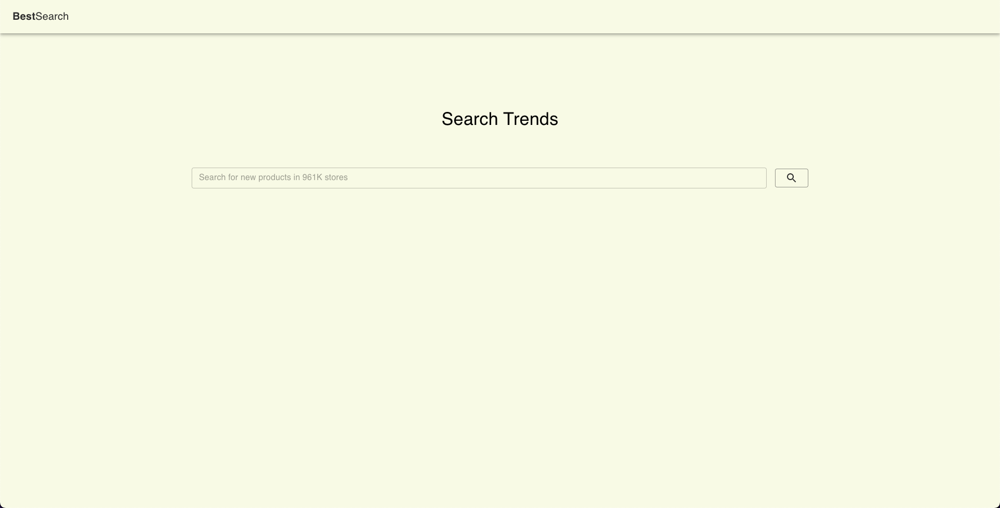
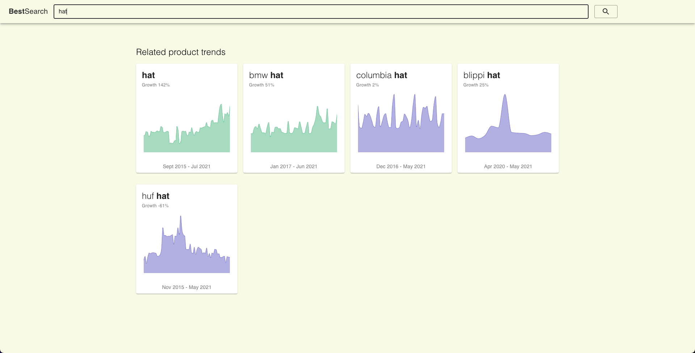

# About Demo-BestSearch
This project was bootstrapped with [Create React App](https://github.com/facebook/create-react-app).

### `npm install`

Runs command installs all packages that project depends on.

### `npm start`

Runs the app in the development mode.\
Open [http://localhost:3000](http://localhost:3000) to view it in your browser.

The page will reload when you make changes.\
You may also see any lint errors in the console.

### Run successfully

If you see the output of the image on the command line, 🎉 congratulations, you have successfully run the project in development mode and you can now view [http://localhost:3000](http://localhost:3000) in the browser.

## Preview

#### Home page

#### Search page

